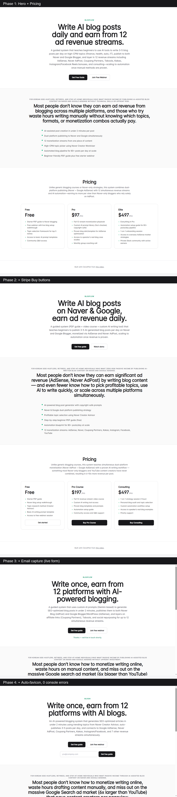

# ClonePilot

> The MCP server that watches a YouTube business video for you, then ships the MVP.



<!-- Uncomment once published on Smithery + PyPI -->
<!-- [](https://smithery.ai/server/@askbit/clonepilot) -->
<!-- [](https://pypi.org/project/clonepilot/) -->

[Live demo](https://blogflow-nine.vercel.app) · [v0.1.0 release](https://github.com/a01050398694-commits/clonepilot/releases/tag/v0.1.0) · [Launch playbook](docs/MARKETING.md)


Paste a YouTube URL into Claude Code, Claude Desktop, or Codex. ClonePilot extracts the business model (target, problem, solution, pricing, channel), scaffolds a Next.js landing page in that style, deploys it to Vercel, and hands you back a live URL.

## Why

App builders like bolt.new, Lovable, and v0 are great — but you still have to write the prompt. Indie hackers learn about businesses by watching YouTube. ClonePilot closes that loop: video in, deployed clone out.

## Tools exposed

| Tool | What it does |
|---|---|
| `analyze(youtube_url)` | Transcript + Claude → structured `BusinessBlueprint` JSON. |
| `scaffold(blueprint, payment_links?)` | Generates a Next.js 15 + Tailwind landing page. Optionally bakes Stripe Buy buttons into the pricing tiers. |
| `deploy(repo_path)` | Pushes to Vercel via REST API. Auto-disables SSO protection. Returns the live `*.vercel.app` URL. |
| `monetize(blueprint)` | Creates a Stripe Product + Price + Payment Link per paid tier. Falls back to PREVIEW links when `STRIPE_SECRET_KEY` is missing. |
| `marketing_kit(blueprint, live_url?)` | Claude-generated launch copy: X thread, Product Hunt, Show HN, Reddit, LinkedIn, ad creatives. |
| `attach_domain(project, domain)` | Attach a custom domain to a Vercel project. Returns DNS records to add if the domain isn't already on Vercel. |
| `oneshot(youtube_url, lead_destination?)` | The full pipeline in a single call: analyze → monetize → scaffold (with email capture if `lead_destination` set) → deploy (with required env vars pushed) → marketing_kit. ~2-3 min. |
| `version()` | Health check — shows which env vars the server can see. |

## Install

```bash
uvx --from git+https://github.com/a01050398694-commits/clonepilot clonepilot
```

Or wire it straight into Claude Desktop / Claude Code / Cursor / Codex — full instructions in [`docs/INSTALL.md`](docs/INSTALL.md).

When ClonePilot lands on PyPI (Phase 5), the install shortens to `uvx clonepilot`.

## Configure (Claude Desktop)

`~/Library/Application Support/Claude/claude_desktop_config.json` (mac) or `%APPDATA%\Claude\claude_desktop_config.json` (Windows):

```json
{
  "mcpServers": {
    "clonepilot": {
      "command": "uvx",
      "args": ["clonepilot"],
      "env": {
        "ANTHROPIC_API_KEY": "sk-ant-...",
        "SUPADATA_API_KEY": "...",
        "VERCEL_TOKEN": "..."
      }
    }
  }
}
```

Claude Code, Cursor, and Codex use the same `mcpServers` format.

## Required env vars

See `.env.example`. The three required for Phase 1 are `ANTHROPIC_API_KEY`, `SUPADATA_API_KEY`, and `VERCEL_TOKEN`.

## License

MIT.
